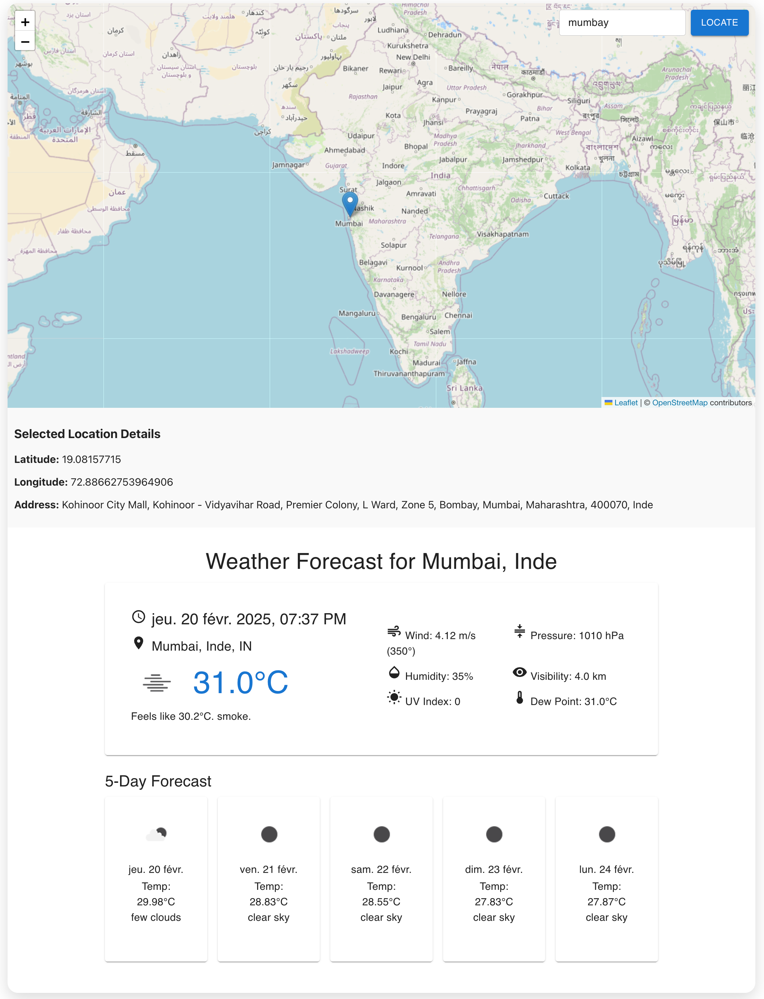

# 📍 Location Map & Weather Forecast React App

A React-based web application that displays a location map using Leaflet and provides real-time weather information with a 5-day forecast using the OpenWeatherMap API. It features address search powered by LocationIQ, automatic geolocation, and a responsive UI styled with Material-UI (@mui/material).

---

## 📚 Table of Contents
- [🚀 Features](#-features)  
- [🏗️ Technologies Used](#-technologies-used)  
- [⚙️ Installation](#️-installation)  
- [💻 Usage](#-usage)  
- [🌦️ Application Overview](#️-application-overview)  
- [🧩 Project Structure](#-project-structure)  
- [🌍 API References](#-api-references)  
- [🔒 Environment Variables](#-environment-variables)  
- [🎨 UI Highlights](#-ui-highlights)  
- [🧪 Testing](#-testing)  
- [📝 Contributing](#-contributing)  
- [🖇️ License](#️-license)  
- [✨ Acknowledgments](#-acknowledgments)  
- [🔗 Contact](#-contact)  

---

## 🚀 Features
- 🌍 Interactive map with draggable markers (Leaflet + React-Leaflet)  
- 📍 Address search and reverse geocoding using LocationIQ  
- ☀️ Real-time current weather details  
- 🌦️ 5-day weather forecast with icons and detailed metrics  
- 📱 Responsive UI using Material-UI (@mui/material)  
- 📡 Weather updates on map click based on latitude and longitude  
- 🌐 Localization of dates and weather conditions  
- 🔐 API keys stored in `.env` for secure access  

---

## 🏗️ Technologies Used
- React (v19.0.0)  
- Leaflet (v1.9.4) & React-Leaflet (v5.0.0)  
- Material-UI (v6.4.5)  
- Axios for API requests  
- OpenWeatherMap API  
- LocationIQ API  
- React-Scripts (v5.0.1)  

---

## ⚙️ Installation

1. **Clone the repository:**
   ```bash
   git clone <repository-url>
   cd location-map
   ```

2. **Install dependencies:**
   ```bash
   npm install
   ```

3. **Configure environment variables:**

   Create a `.env` file in the root directory:
   ```plaintext
   REACT_APP_LOCATIONIQ_API_KEY=your_locationiq_api_key
   REACT_APP_WEATHER_API_KEY=your_openweathermap_api_key
   ```

---

## 💻 Usage

1. **Start the development server:**
   ```bash
   npm start
   ```
   This will run the app at [http://localhost:3000](http://localhost:3000).

2. **Build for production:**
   ```bash
   npm run build
   ```

---

## 🌦️ Application Overview
- On app load, the map centers on default coordinates (**Paris, France**).  
- **Clicking on the map:**
  - Updates the marker position.
  - Fetches the corresponding address via LocationIQ.
  - Displays current weather and 5-day forecast for the selected location.
- **Entering an address in the search bar:**
  - Re-centers the map to the searched address.
  - Updates the weather data based on new coordinates.

---
## Screenshots

---

## 🧩 Project Structure

```
location-map/
├── public/
│   └── index.html
├── src/
│   ├── Components/
│   │   ├── LocationMap.jsx          # Interactive map with address search
│   │   ├── WeatherForecastApp.jsx   # Displays weather info and forecast
│   │   └── services.jsx             # API call handlers for LocationIQ & OpenWeatherMap
│   ├── App.js                       # Main React component
│   ├── App.css                      # Custom styles
│   └── index.js                     # ReactDOM render
├── .env                             # Environment variables (API keys)
├── package.json                     # Project dependencies and scripts
└── README.md                        # Documentation
```

---

## 🌍 API References
- **LocationIQ Geocoding API**  
  Used for forward (address to coordinates) and reverse (coordinates to address) geocoding.  
  📚 [API Docs](https://locationiq.com/docs)

- **OpenWeatherMap API**  
  Fetches real-time weather data and 5-day forecasts.  
  📚 [API Docs](https://openweathermap.org/api)

---

## 🔒 Environment Variables

Ensure you replace the placeholders with your actual API keys in the `.env` file.

```plaintext
REACT_APP_LOCATIONIQ_API_KEY=your_locationiq_api_key
REACT_APP_WEATHER_API_KEY=your_openweathermap_api_key
```

---

## 🎨 UI Highlights

- **Weather icons dynamically fetched:**
  - Small: `https://openweathermap.org/img/wn/{icon}.png`
  - Large: `https://openweathermap.org/img/wn/{icon}@2x.png`

- **Current weather details:**
  - Temperature, feels-like temperature, cloud conditions, humidity, UV index, pressure, wind speed, visibility.

- **Forecast display:**
  - 5-day forecast in a single row with icons above temperatures.
  - Dates formatted as `Thu, Feb 25` according to the user’s locale.

---

## 🧪 Testing

Run tests using:
```bash
npm test
```
Testing is powered by **@testing-library/react** and **jest**.

---

## 📝 Contributing

Contributions are welcome!  

1. Fork the repo  
2. Create your feature branch:  
   ```bash
   git checkout -b feature/AmazingFeature
   ```
3. Commit your changes:  
   ```bash
   git commit -m 'Add some AmazingFeature'
   ```
4. Push to the branch:  
   ```bash
   git push origin feature/AmazingFeature
   ```
5. Open a **Pull Request**

---

## 🖇️ License

This project is licensed under the **MIT License**. See the [LICENSE](LICENSE) file for details.

---

## ✨ Acknowledgments

- 🌍 [Leaflet](https://leafletjs.com/)  
- 🌿 [React-Leaflet](https://react-leaflet.js.org/)  
- 🌦️ [OpenWeatherMap](https://openweathermap.org/)  
- 🗺️ [LocationIQ](https://locationiq.com/)  
- 🎨 [Material-UI](https://mui.com/)

---

## 🔗 Contact

For any queries or contributions:

- 🐙 GitHub: [smonier](https://github.com/smonier)  
- 📧 Email: [smonier@jahia.com](mailto:smonier@jahia.com)  

---

✨ **Happy Coding! 🚀**
